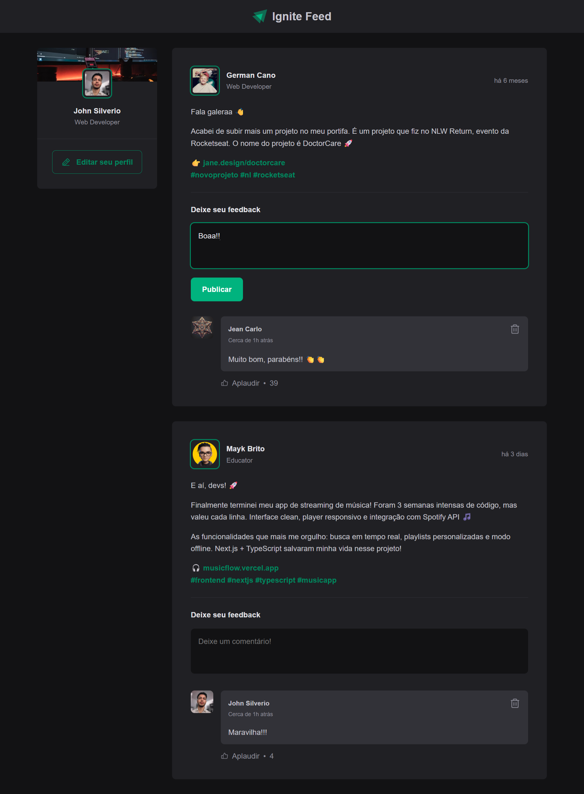
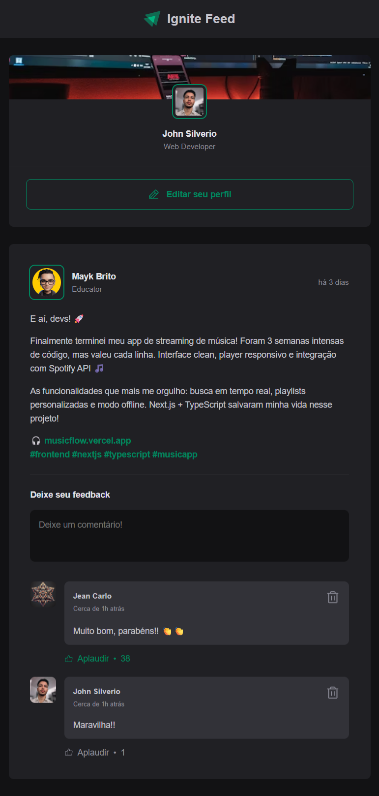

# ignite feed

uma rede social simples para desenvolvedores compartilharem seus projetos e interagirem através de comentários.

projeto desenvolvido durante o ignite da rocketseat (trilha de 2022), focado em fundamentos do react e boas práticas de desenvolvimento.

## preview

<div align="center">
  
  
</div>

## sobre o projeto

o ignite feed é uma aplicação de feed de posts onde é possível:

- visualizar posts de diferentes desenvolvedores
- publicar comentários em posts
- aplaudir comentários (sistema de likes)
- deletar comentários
- validação de formulário para evitar comentários vazios

a interface conta com sidebar de perfil, header com logo do ignite, e um feed responsivo que se adapta bem tanto em desktop quanto mobile.

## tecnologias utilizadas

- **react** - biblioteca para construção da interface
- **typescript** - tipagem estática para javascript
- **vite** - build tool e dev server
- **css modules** - estilização com escopo local
- **date-fns** - manipulação e formatação de datas
- **phosphor icons** - biblioteca de ícones

## estrutura do projeto

```
src/
├── components/
│   ├── Avatar.tsx
│   ├── Comment.tsx
│   ├── Header.tsx
│   ├── Post.tsx
│   └── Sidebar.tsx
├── App.tsx
├── global.css
└── main.tsx
```

## como executar

antes de começar, você precisa ter o node.js instalado na sua máquina. este projeto utiliza o pnpm como gerenciador de pacotes.

```bash
# clone o repositório
git clone https://github.com/johnsilverio/ignite-feed.git

# entre na pasta do projeto
cd ignite-feed

# instale as dependências
pnpm install

# execute o projeto em modo de desenvolvimento
pnpm dev
```

o projeto estará disponível em `http://localhost:5173`

## funcionalidades implementadas

### sistema de comentários

cada post possui um formulário onde você pode adicionar novos comentários. os comentários incluem:

- nome do autor
- avatar
- texto do comentário
- contador de aplausos
- botão de deletar

### validação de formulário

o campo de comentário não permite envio vazio e exibe uma mensagem de erro caso o usuário tente submeter sem preencher.

### datas relativas

utiliza date-fns para mostrar quando o post foi publicado de forma relativa (ex: "há 2 horas") e também a data formatada completa no atributo title.

### componentes reutilizáveis

o componente `Avatar` é reutilizado em diferentes contextos, podendo ou não ter borda através da prop `hasBorder`.

## conceitos aplicados

- componentização
- propriedades (props)
- estados (useState)
- imutabilidade
- key em listas
- typescript com react
- css modules
- formulários controlados
- eventos no react

## autor

desenvolvido por [john silverio](https://github.com/johnsilverio)

<div align="center">
  
</div>
